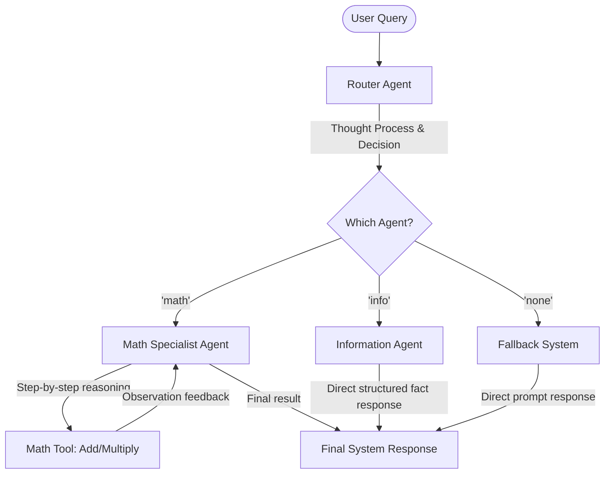

# AI Agents from Scratch

A comprehensive curriculum and implementation playground demonstrating the step-by-step construction of autonomous AI agents. This repository starts with simple chat interfaces and scales to structured JSON action loops, dependency graphs, observability tracers, and multi-agent coordination systems, all powered locally via `llama-cpp-python` and small open-source LLMs.


---

## 🚀 Getting Started

### Prerequisites

* Python 3.8 or higher
* C/C++ compiler toolchain (required for building `llama-cpp-python` bindings)

### Setup Instructions

1. **Clone and Navigate to the Repository:**
   ```bash
   git clone <repository_url>
   cd Agent
   ```

2. **Establish the Virtual Environment:**
   ```bash
   # Create a virtual environment named 'myenv' as expected by the scripts
   python3 -m venv myenv
   source myenv/bin/activate
   ```

3. **Install Dependencies:**
   Ensure your compiler is configured for your hardware acceleration (e.g., CUDA, Metal, etc.) if applicable, then install the package:
   ```bash
   pip install --upgrade pip
   pip install llama-cpp-python
   ```

4. **Acquire the Model:**
   The scripts are configured to load a quantized TinyLlama model. Download the GGUF file and place it in your virtual environment directory (`myenv/`):
   ```bash
   mkdir -p myenv
   # Download the tinyllama chat model GGUF file
   curl -L -o myenv/tinyllama-1.1b-chat-v1.0.Q4_K_M.gguf https://huggingface.co/TheBloke/TinyLlama-1.1B-Chat-v1.0-GGUF/resolve/main/tinyllama-1.1b-chat-v1.0.Q4_K_M.gguf
   ```

---

## 📚 Curriculum & Files Directory

Each script represents a distinct lesson in building autonomous capabilities:

| Lesson / File | Category | Description |
| :--- | :--- | :--- |
| [basic_chat.py](file:///home/vikas/prep/Agent/basic_chat.py) | Foundations | Implements the [BasicChatbot](file:///home/vikas/prep/Agent/basic_chat.py#L7) class for an interactive chat loop showcasing history management and simple text generation. |
| [rhyme_bot.py](file:///home/vikas/prep/Agent/rhyme_bot.py) | Prompt Engineering | Implements the [RhymeBot](file:///home/vikas/prep/Agent/rhyme_bot.py#L6) class demonstrating system prompts and instructions forcing specific styles/personas (e.g. rhyming). |
| [json_validator.py](file:///home/vikas/prep/Agent/json_validator.py) | Reliability | Implements the [JSONValidatorBot](file:///home/vikas/prep/Agent/json_validator.py#L7) class with programmatic retries (up to 3 attempts) to ensure the LLM's response successfully parses as valid JSON. |
| [longterm_memory.py](file:///home/vikas/prep/Agent/longterm_memory.py) | State & Memory | Implements the [LongTermMemoryBot](file:///home/vikas/prep/Agent/longterm_memory.py#L8) class introducing long-term persistent session memory by reading and writing user state to a local JSON file (`memory.json`). |
| [router_agent.py](file:///home/vikas/prep/Agent/router_agent.py) | Architecture | Implements the [RouterAgentBot](file:///home/vikas/prep/Agent/router_agent.py#L6) class running a classifier system that acts as a receptionist, routing the user query to specialized system prompts or custom logic. |
| [planning_agent.py](file:///home/vikas/prep/Agent/planning_agent.py) | Planning | Implements the [PlanningAgentBot](file:///home/vikas/prep/Agent/planning_agent.py#L6) class using grammar-constrained output to force the LLM to generate a rigid 3-step JSON plan, executed sequentially. |
| [structured_actions.py](file:///home/vikas/prep/Agent/structured_actions.py) | Grammar Constraints | Implements the [StructuredActionsAgent](file:///home/vikas/prep/Agent/structured_actions.py#L6) class utilizing GBNF grammars to strictly control model outputs into dynamic JSON actions, supporting autonomous loops. |
| [dependency_graphs.py](file:///home/vikas/prep/Agent/dependency_graphs.py) | Complex Execution | Implements the [DependencyGraphAgent](file:///home/vikas/prep/Agent/dependency_graphs.py#L7) class mapping a project to a directed acyclic graph (DAG), resolving tasks in topological order. |
| [testing_reliability.py](file:///home/vikas/prep/Agent/testing_reliability.py) | Evaluation | Implements the [ReliabilityAgent](file:///home/vikas/prep/Agent/testing_reliability.py#L7) class employing an LLM-as-a-Judge pattern to grade worker outputs and trigger self-correction loops. |
| [observability.py](file:///home/vikas/prep/Agent/observability.py) | Monitoring | Implements [InstrumentedAgent](file:///home/vikas/prep/Agent/observability.py#L30) and [AgentTracer](file:///home/vikas/prep/Agent/observability.py#L9) classes tracking request latencies, token consumption, and recording structured execution traces. |
| [tool_user.py](file:///home/vikas/prep/Agent/tool_user.py) | Function Calling | Implements the [ToolUserAgent](file:///home/vikas/prep/Agent/tool_user.py#L6) class exploring native tool bindings and API specifications to guide standard JSON tool execution. |
| [autonomous_react.py](file:///home/vikas/prep/Agent/autonomous_react.py) | ReAct Paradigm | Implements the [AutonomousReActAgent](file:///home/vikas/prep/Agent/autonomous_react.py#L7) class executing a complete Reason-Act-Observe loop (up to 5 steps) utilizing model tool-calling schemas. |
| [master_agent_system.py](file:///home/vikas/prep/Agent/master_agent_system.py) | Multi-Agent | Coordinates routing decisions across specialized sub-agents [RouterAgent](file:///home/vikas/prep/Agent/master_agent_system.py#L174), [MathAgent](file:///home/vikas/prep/Agent/master_agent_system.py#L78), and [InfoAgent](file:///home/vikas/prep/Agent/master_agent_system.py#L139) via robust, structured GBNF grammars. |


---

## 🛠️ The Orchestrator: Master Agent System

The centerpiece, [master_agent_system.py](file:///home/vikas/prep/Agent/master_agent_system.py), shows multi-agent collaboration:



### Key Features of the Refactored Master Agent System:
* **Strict Type Checking & Type Hints**: Leverages Python's standard `typing` annotations.
* **OOP Architecture**: Classes for sub-agents (`RouterAgent`, `MathAgent`, `InfoAgent`) make adding new specialized capabilities modular and straightforward.
* **Robust Terminal Handling**: Gracefully intercepts `Ctrl+C` (KeyboardInterrupt) and `Ctrl+D` (EOFError) for a clean terminal exit experience.
* **Precise Exception Handling**: Categorizes JSON decode errors and structural routing errors cleanly, preventing program crashes.

### Running the Orchestrator
```bash
python master_agent_system.py
```
*(Ensure your virtual environment is active and the model is downloaded to the `myenv/` directory).*

